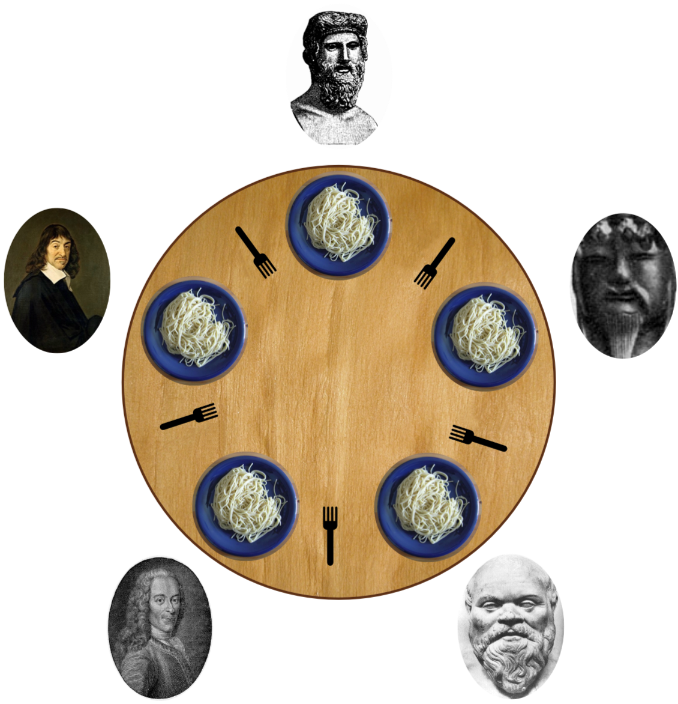

**Task2:** Javada deadlock deb, bir vaqtning ozida ikki yoki undan ortiq mavzular 
bir-birining resurslarni chiqarishini kutayotganda tiqilib qoladi. Shunga deadloch deyiladi.

Bunga eng zo'r misol qilib _faylasuflar_ hechki ovqatini keltirish mumkin:

5 ta faylasuflar ovqatlanish stoli atrofida o'tiribdi. 
Har bir qo'shni faylasuf juftligi o'rtasida sanchqi bor va faylasuf ovqatlanish uchun ikkita vilkadan foydalanishi kerak.

Mana shu yerda deadlock sodir bo'ladi.

Barcha faylasuflar bir vaqtning o'zida o'ng tomonidagi vilkani ko'taradilar.
Endi har bir faylasuf o'zining chap tomonidagi vilkalar paydo bo'lishini kutmoqda, lekin uni boshqa bir faylasuf ushlab turgan bo'ladi.
Hech bir faylasuf ikkala sanchqisiz ovqatlana olmagani uchun, ularning hammasi qo‘lidagi vilkasini bo‘shata olmay, abadiy kutishadi. 
Shularning hech biri ovqat yemasdan o'tiraverda.

Deadlock larni oldini olish uchun biz lock larni ishlatsak bo'ladi.

Biz har bir vilka uchun lock belgilashimiz mumkin. 
Faylasuf vilka olishdan oldin, u vilka bilan bog'liq bo'lgan lock ni olishi kerak. 
Agar lock mavjud bo'lmasa, faylasuf u mavjud bo'lguncha kutadi.
Faylasuf chap vilkani olishga harakat qiladi va keyin o'ng vilkani olishga harakat qiladi. 
Agar o'ng vilka mavjud bo'lmasa, faylasuf deadlock dan qochish uchun chap vilkani chiqaradi. 
Bu barcha faylasuflarning boshi berk ko'chaga tushib qolmasdan ovqatlanishini ta'minlaydi.

Shuningdek, biz multithreading lar bilan ham deadlock lardan saqlanishimiz mumkin.
Bu uslubdan foydalanish uchun faylasuflar ikkala vilkani bir vaqtning o'zida ololmaydigan qilib qo'ysak bo'ldi.

**Task5:** "^(0[1-9]|[12][0-9]|3[01])[./](0[1-9]|1[0-2])[./](?:19|20)\d\d$" 